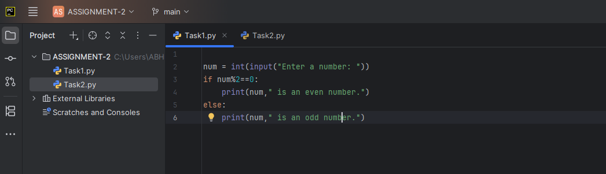
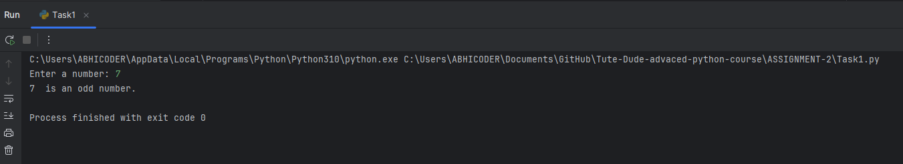
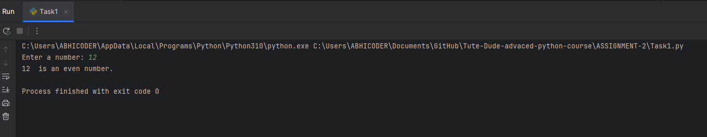
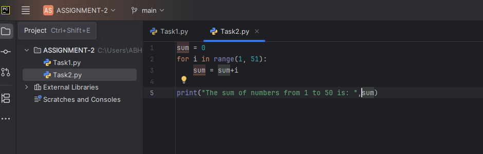
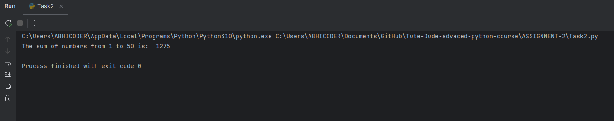

**🚀 Project Title & Tagline**
--------------------------------

**Project Title:** Simple Python Programs
**Tagline:** Exploring the Basics of Python Programming

**📖 Description**
----------------

This project is a collection of two simple Python programs that demonstrate basic concepts in programming. The first program, `Task2.py`, calculates the sum of numbers from 1 to 50, while the second program, `Task1.py`, determines whether a user-input number is even or odd. These programs serve as a starting point for beginners to learn the fundamentals of Python programming.

**✨ Features**
--------------

1. **Calculates Sum of Numbers**: The `Task2.py` program demonstrates a basic loop that calculates the sum of numbers from 1 to 50.
2. **User-Input Validation**: The `Task1.py` program uses an `if-else` statement to determine whether a user-input number is even or odd.
3. **Simple and Easy to Understand**: Both programs are designed to be easy to understand and modify, making them perfect for beginners.
4. **Reusable Code**: The code can be reused or modified to solve similar problems.
5. **Cross-Platform Compatibility**: The programs are written in Python and can run on any platform that supports Python.
6. **Open-Source**: The project is open-source, allowing users to modify and contribute to the code.
7. **Easy to Debug**: The code is designed to be easy to debug, making it perfect for beginners.
8. **Fast Execution**: The programs execute quickly, making them suitable for rapid prototyping and testing.

**🧰 Tech Stack Table**
----------------------

| Tech Stack | Version |
| --- | --- |
| Python | 3.10|
| Text Editor/IDE | PyCharm Python Editor |

**📁 Project Structure**
-------------------------

```
📦 Interactive-Python-Project
├── Task1.py
├── Task2.py
├── README.md
└── images
    ├── task1_input.png
    ├── task1_foutput.png
    ├── task1_loutput.png
    ├── task2_input.png
    └── task2_output.png
```

**⚙️ How to Run**
----------------

1. **Setup**: Install Python on your computer if you haven't already.
2. **Environment**: Open a terminal or command prompt and navigate to the project directory.
3. **Build**: Run the programs using the following commands:
	* `python Task1.py` to run `Task1.py`
	* `python Task2.py` to run `Task2.py`
4. **Deploy**: There is no deployment required for this project, as it is a simple Python program.

**🧪 Testing Instructions**
-------------------------

1. **Test 1**: Run `Task1.py` and enter an even number, such as 10. Verify that the program outputs "10 is an even number."
2. **Test 2**: Run `Task1.py` and enter an odd number, such as 11. Verify that the program outputs "11 is an odd number."
3. **Test 3**: Run `Task2.py` and verify that the program outputs the correct sum of numbers from 1 to 50.

## 📸 Screenshots**
----------------


### 🧮 Task1: Check if a Number is Even or Odd

#### 🔹 Code:


#### 🔹 Output(1):


#### 🔹 Output(2):


---

### 🙋‍♂️ Task2: Sum of Integers from 1 to 50 Using For Loop:

#### 🔹 Code:


#### 🔹 Output:


**📦 API Reference**
-------------------

Since this is a simple Python project, there is no API reference.

### 👤 Author

- **Name:** Abhishek Thakur  
- **Email:** [abhishekthakur202398@gmail.com](mailto:abhishekthakur202398@gmail.com)  
- **GitHub:** [github.com/abhithakjutre](https://github.com/abhithakjutre)  
- **Portfolio:** [abhithakur-portfolio.netlify.app](https://abhithakur-portfolio.netlify.app/)

**📝 License**
------------

This project is licensed under the MIT License. See `LICENSE` for details.

I hope this README.md file is helpful in providing a detailed overview of the project.
